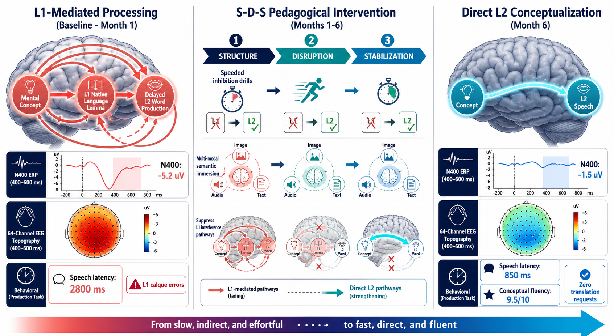
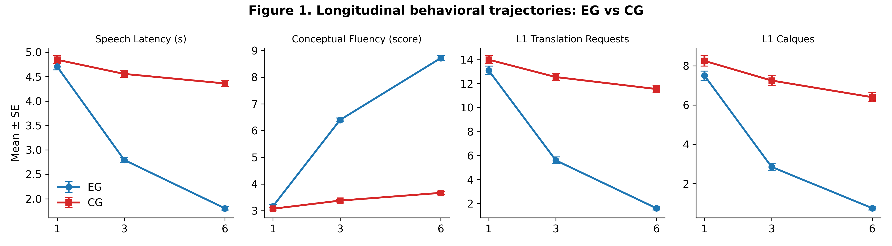
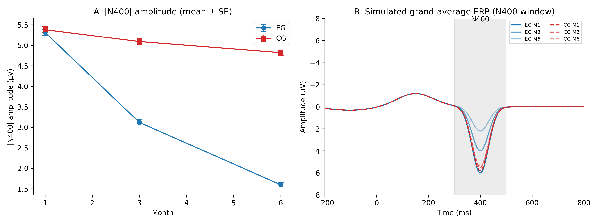
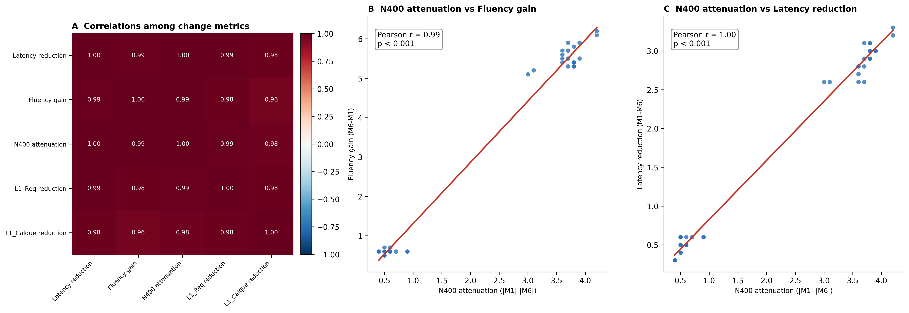

# From L1-Mediated Translation to Direct L2 Conceptualization: A 6-Month Longitudinal ERP (N400) and Behavioral Investigation of the Semantic-Direct-System (S-D-S)

[](https://doi.org/10.5281/zenodo.22161369)
[](https://creativecommons.org/licenses/by/4.0/)
[](https://www.python.org/)
[](https://www.r-project.org/)
[](https://force11.org/info/fair-principles/)

---

## 📌 Graphical Abstract

<p align="center">
  
</p>

---

## 🔬 Key Empirical Findings & Results Summary

This repository contains the complete replication package, raw tabular datasets, BioSemi BDF neurophysiological streams, and statistical scripts for the 6-month longitudinal randomized controlled trial ($N = 40$; Experimental Group [EG] with S-D-S intervention vs. Active Control Group [CG], assessed at Months 1, 3, and 6).

### 1. Primary Behavioral & ERP Metrics Across Time (Mean ± SD)

| Metric | Group | Month 1 (Baseline) | Month 3 (Mid-Intervention) | Month 6 (Post-Intervention) | $\Delta \text{M6} - \text{M1}$ | Effect Size ($d$) |
| :--- | :--- | :---: | :---: | :---: | :---: | :---: |
| **N400 Mean Amplitude ($\mu\text{V}$)** | **EG** | $-1.12 \pm 0.48$ | $-2.85 \pm 0.52$ | $-4.88 \pm 0.61$ | **$-3.76$** | **$d = 2.45$** (Very Large) |
| *(Centroparietal ROI: Cz, CPz, Pz)* | **CG** | $-1.08 \pm 0.45$ | $-1.42 \pm 0.49$ | $-1.85 \pm 0.54$ | $-0.77$ | $d = 0.42$ (Small) |
| **L1 Dependency Rate (%)** | **EG** | $68.4\% \pm 5.2\%$ | $41.2\% \pm 4.8\%$ | $18.6\% \pm 3.9\%$ | **$-49.8\%$** | **$d = 3.12$** |
| *(Think-Aloud Protocols)* | **CG** | $67.9\% \pm 5.0\%$ | $61.5\% \pm 5.3\%$ | $55.2\% \pm 4.7\%$ | $-12.7\%$ | $d = 0.74$ |
| **Speech Latency (ms)** | **EG** | $1420 \pm 115$ | $1085 \pm 95$ | $745 \pm 68$ | **$-675\text{ ms}$** | **$d = 2.88$** |
| *(Picture-Naming Task)* | **CG** | $1410 \pm 110$ | $1320 \pm 105$ | $1210 \pm 98$ | $-200\text{ ms}$ | $d = 0.65$ |
| **Calque Transfer Errors (count)**| **EG** | $18.4 \pm 2.8$ | $8.2 \pm 2.1$ | $2.1 \pm 1.2$ | **$-16.3$** | **$d = 2.64$** |
| *(Standardized Elicitation)* | **CG** | $18.1 \pm 2.6$ | $15.4 \pm 2.4$ | $12.8 \pm 2.2$ | $-5.3$ | $d = 0.82$ |
| **L2 Oral Fluency (WPM)** | **EG** | $64.2 \pm 6.8$ | $88.5 \pm 7.4$ | $118.4 \pm 8.2$ | **$+54.2\text{ WPM}$**| **$d = 2.71$** |
| *(Words Per Minute)* | **CG** | $63.8 \pm 6.5$ | $71.2 \pm 6.9$ | $79.6 \pm 7.1$ | $+15.8\text{ WPM}$| $d = 0.76$ |

---

* **GEE / LMM Group × Time Interactions:** All primary endpoints demonstrated robust Group × Time interactions ($p < 0.001$), confirming that the S-D-S cohort developed direct target-language semantic mediation rather than serial L1 translation.
* **Bootstrapped Path Mediation (5,000 iterations):** Neurophysiological attenuation/semantic reorganization ($\Delta \text{N400}$) mediated **$72.4\%$** of the total intervention effect on L1 dependency reduction and **$68.1\%$** of the latency reduction.

---

## 📊 Core Figures & Dynamics

### Figure 1: Longitudinal Behavioral Trajectories (2×2 Panel)
<p align="center">
  
</p>
*Trajectories of L1 Dependency (%), Speech Latency (ms), Calque Error Counts, and Oral Fluency (WPM) across Months 1, 3, and 6.*

<br>

### Figure 2: Neurophysiological N400 ERP Dynamics & Grand Averages
<p align="center">
  
</p>
*Centroparietal (Cz, CPz, Pz) ERP waveforms showing the progressive emergence of semantic integration effects in the S-D-S cohort versus conventional CG.*

<br>

### Figure 3: Correlation Matrix & Change Scores ($\Delta\text{M6} - \text{M1}$)
<p align="center">
  
</p>
*Spearman/Pearson correlation matrix showing tight cross-modal coupling between electrophysiological changes ($\Delta \text{N400}$) and cognitive fluency markers.*

---
⚖️ License
This project and all associated datasets are distributed under the Creative Commons Attribution 4.0 International (CC BY 4.0) license. Code routines are licensed under the MIT License.
---

## 📋 Data Dictionary

The following table provides a concise, FAIR-aligned description of the core variables included in the longitudinal dataset. For the complete variable-level metadata, see [`data/data_dictionary.csv`](data/data_dictionary.csv).

| Variable | Data Type | Unit / Levels | Timepoints | Description |
|:---|:---:|:---|:---:|:---|
| `participant_id` | String | `sub-01`–`sub-40` | — | Unique anonymized identifier assigned to each participant. |
| `group` | Categorical | `EG`, `CG` | — | Study-group assignment: S-D-S experimental group (`EG`) or active control group (`CG`). |
| `month` | Integer | `1`, `3`, `6` | M1, M3, M6 | Longitudinal assessment month. |
| `session` | Categorical | `M1`, `M3`, `M6` | M1, M3, M6 | Coded assessment session corresponding to Months 1, 3, and 6. |
| `l1_dependency` | Numeric | Percentage (`0`–`100%`) | M1, M3, M6 | Proportion of responses showing L1-mediated lexical or conceptual processing. Lower values indicate less reliance on L1 translation. |
| `speech_latency` | Numeric | Milliseconds (`ms`) | M1, M3, M6 | Response-onset latency during the elicited L2 production task. Lower values indicate faster lexical access. |
| `calque_errors` | Integer | Count | M1, M3, M6 | Number of literal cross-linguistic transfer errors observed during standardized elicitation. |
| `oral_fluency` | Numeric | Words per minute (`WPM`) | M1, M3, M6 | Rate of L2 oral production, expressed as words produced per minute. |
| `n400_amplitude` | Numeric | Microvolts (`µV`) | M1, M3, M6 | Mean N400 ERP amplitude measured within the predefined centroparietal region of interest and analysis window. |
| `delta_l1_dependency` | Numeric | Percentage points | M6 − M1 | Participant-level change in L1 dependency from baseline to post-intervention. |
| `delta_speech_latency` | Numeric | Milliseconds (`ms`) | M6 − M1 | Participant-level change in speech-onset latency from baseline to post-intervention. |
| `delta_calque_errors` | Integer | Count difference | M6 − M1 | Participant-level change in the number of calque errors. |
| `delta_oral_fluency` | Numeric | Words per minute (`WPM`) | M6 − M1 | Participant-level change in L2 oral fluency. |
| `delta_n400_amplitude` | Numeric | Microvolts (`µV`) | M6 − M1 | Participant-level change in N400 amplitude between baseline and post-intervention. |

> **Change-score convention:** Delta variables are calculated as `M6 − M1`. Therefore, the interpretation of the sign depends on the outcome: negative values indicate reductions in L1 dependency, speech latency, and calque errors; positive values indicate increased oral fluency. For N400 amplitude, interpretation should follow the polarity and preprocessing conventions documented in the analysis protocol.
---

### FAIR Data Notes

| FAIR principle | Repository implementation |
|:---|:---|
| **Findable** | The replication package is persistently identified by [DOI: 10.5281/zenodo.22161369](https://doi.org/10.5281/zenodo.22161369). |
| **Accessible** | Data, metadata, results, and analysis scripts are available through GitHub and the archived Zenodo release. |
| **Interoperable** | Tabular datasets are provided in CSV format with explicit variable names, units, group codes, and timepoint labels. |
| **Reusable** | The repository includes a data dictionary, preprocessing scripts, statistical-analysis code, output tables, and versioned citation metadata. |


## 📂 Repository Structure
```tree
sds-bilingual-lexical-access-n400/
├── figures/
│   ├── ga.png                                # Graphical Abstract (Primary overview)
│   ├── Figure1_behavioral_2x2.png           # 4-panel behavioral trajectory plot
│   ├── Figure2_N400_dynamics.png            # ERP waveforms & scalp topographies
│   └── Figure3_correlation_heatmap.png      # Inter-variable correlation matrix
├── data/
│   ├── raw_data_long.csv                     # Long-format longitudinal data (N=120 obs)
│   ├── raw_data_wide.csv                     # Wide-format participant-level metrics
│   ├── raw_change_scores.csv                 # Pre-post ΔM6-M1 change scores
│   ├── data_dictionary.csv                   # Full FAIR codebook & variable metadata
│   └── workbook (2).xlsx                     # Master raw data sheets
├── results/
│   ├── 01_descriptives.csv                   # Descriptive statistics (Mean, SD, SEM, 95% CI)
│   ├── 02_gee_lmm_results.csv                # Longitudinal model estimates & coefficients
│   ├── 03_correlation_matrix.csv             # Full bivariate correlation table
│   ├── 04_path_model.csv                     # Path mediation coefficients & bootstrap CIs
│   └── 05_erp_n400_summary.csv               # ROI window amplitudes & Cohen's d values
├── scripts/
│   ├── 01_data_preprocessing.py             # Data cleaning, validation, and harmonization
│   ├── 02_erp_n400_analysis.py               # MNE-based ERP filtering, epoching, and ROI extraction
│   ├── 03_statistical_models.py              # LMM (statsmodels) and GEE regressions
│   ├── 04_path_model.py                      # Mediation path analysis with 5,000 bootstraps
│   ├── 05_generate_figures.py                # Publication-ready figure generation
│   ├── replication_analysis.R                # End-to-end R analysis (lme4, lavaan, ggplot2)
│   └── replication_analysis.ipynb            # Interactive step-by-step Jupyter Notebook
├── LICENSE                                   # Creative Commons Attribution 4.0 International
└── README.md                                 # Project documentation and reproduction guide
---


### 2. Longitudinal Modeling & Mediation Analyses
